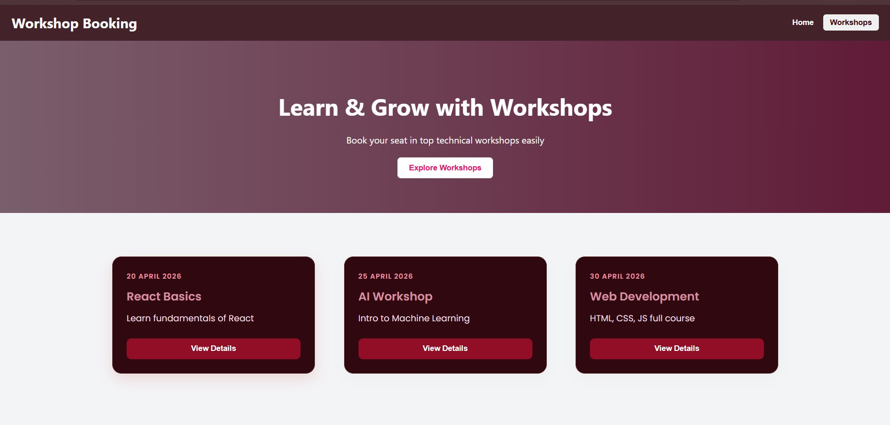

# FOSSEE Workshop Booking UI

This project is a responsive Workshop Booking UI built using React as part of the FOSSEE Internship task.

## 🚀 Features
- Modern and clean user interface
- Fully responsive (mobile + desktop)
- Workshop cards with hover effects
- Interactive buttons and smooth animations

## 🛠 Tech Stack
- React.js
- JavaScript
- CSS (inline styling)

## 📸 Screens
- Navbar
- Hero Section
- Workshop Cards

## ▶️ How to Run Locally
1. Clone the repository
2. Run `npm install`
3. Run `npm start`

## 📸 Project Screenshot

## 👩‍💻 Author
Dikshika
